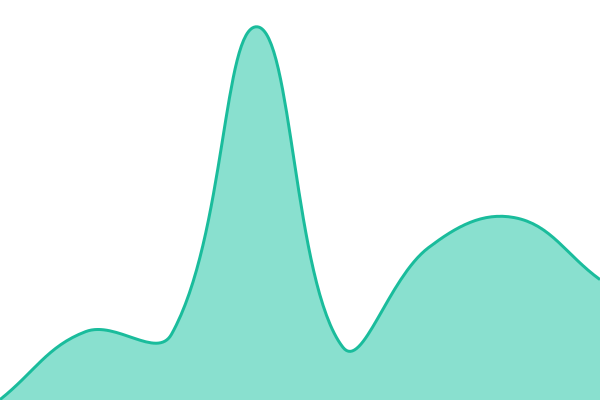
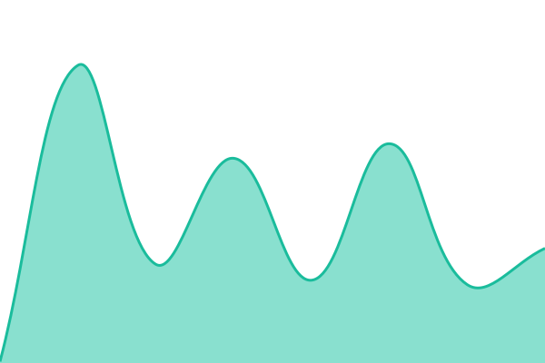
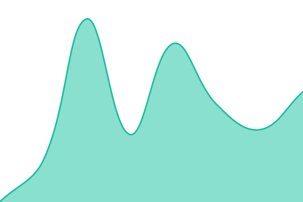
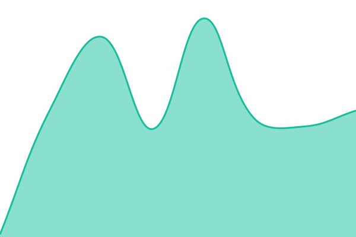

# Aidelly status

Uptime monitoring and the public status page for [Aidelly](https://www.aidelly.ai), published at **[status.aidelly.ai](https://status.aidelly.ai)**.

Built on [Upptime](https://upptime.js.org): GitHub Actions runs the checks, GitHub Issues records incidents, GitHub Pages serves the page. **Nothing here runs on Aidelly's own infrastructure**, which is the point. A status page hosted alongside the product goes dark in exactly the incident it exists for.

<!--start: status pages-->
<!-- This summary is generated by Upptime (https://github.com/upptime/upptime) -->
<!-- Do not edit this manually, your changes will be overwritten -->
<!-- prettier-ignore -->
| URL | Status | History | Response Time | Uptime |
| --- | ------ | ------- | ------------- | ------ |
|  [App and dashboard](https://app.aidelly.ai/api/health) | 🟩 Up | [app-and-dashboard.yml](https://github.com/Aidelly/status/commits/HEAD/history/app-and-dashboard.yml) | 

 336ms
     
 | 

<a href="https://status.aidelly.ai/history/app-and-dashboard">100.00%</a>
    

|  [Publishing](https://app.aidelly.ai/api/health/publishing) | 🟩 Up | [publishing.yml](https://github.com/Aidelly/status/commits/HEAD/history/publishing.yml) | 

 285ms
     
 | 

<a href="https://status.aidelly.ai/history/publishing">95.18%</a>
    

|  [Public API](https://app.aidelly.ai/api/public/v1/posts) | 🟩 Up | [public-api.yml](https://github.com/Aidelly/status/commits/HEAD/history/public-api.yml) | 

 279ms
     
 | 

<a href="https://status.aidelly.ai/history/public-api">100.00%</a>
    

|  [MCP server](https://app.aidelly.ai/api/mcp) | 🟩 Up | [mcp-server.yml](https://github.com/Aidelly/status/commits/HEAD/history/mcp-server.yml) | 

 159ms
     
 | 

<a href="https://status.aidelly.ai/history/mcp-server">100.00%</a>
    

|  [Instagram and Facebook](https://graph.facebook.com/v21.0/me) | 🟩 Up | [instagram-and-facebook.yml](https://github.com/Aidelly/status/commits/HEAD/history/instagram-and-facebook.yml) | 

 238ms
     
 | 

<a href="https://status.aidelly.ai/history/instagram-and-facebook">100.00%</a>
    

|  [Threads](https://graph.threads.net/v1.0/me) | 🟩 Up | [threads.yml](https://github.com/Aidelly/status/commits/HEAD/history/threads.yml) | 

 192ms
     
 | 

<a href="https://status.aidelly.ai/history/threads">100.00%</a>
    

|  [LinkedIn](https://api.linkedin.com/v2/me) | 🟩 Up | [linked-in.yml](https://github.com/Aidelly/status/commits/HEAD/history/linked-in.yml) | 

 134ms
     
 | 

<a href="https://status.aidelly.ai/history/linked-in">100.00%</a>
    

|  [X](https://api.twitter.com/2/users/me) | 🟩 Up | [x.yml](https://github.com/Aidelly/status/commits/HEAD/history/x.yml) | 

 95ms
     
 | 

<a href="https://status.aidelly.ai/history/x">100.00%</a>
    

|  [TikTok](https://open.tiktokapis.com/v2/user/info/) | 🟩 Up | [tik-tok.yml](https://github.com/Aidelly/status/commits/HEAD/history/tik-tok.yml) | 

 181ms
     
 | 

<a href="https://status.aidelly.ai/history/tik-tok">100.00%</a>
    

|  [YouTube](https://www.googleapis.com/youtube/v3/channels) | 🟩 Up | [you-tube.yml](https://github.com/Aidelly/status/commits/HEAD/history/you-tube.yml) | 

 53ms
     
 | 

<a href="https://status.aidelly.ai/history/you-tube">100.00%</a>
    

|  [Pinterest](https://api.pinterest.com/v5/user_account) | 🟩 Up | [pinterest.yml](https://github.com/Aidelly/status/commits/HEAD/history/pinterest.yml) | 

 174ms
     
 | 

<a href="https://status.aidelly.ai/history/pinterest">100.00%</a>
    

|  [Google Business Profile](https://mybusinessaccountmanagement.googleapis.com/v1/accounts) | 🟩 Up | [google-business-profile.yml](https://github.com/Aidelly/status/commits/HEAD/history/google-business-profile.yml) | 

 70ms
     
 | 

<a href="https://status.aidelly.ai/history/google-business-profile">100.00%</a>
    

|  [Bluesky](https://bsky.social/xrpc/com.atproto.server.describeServer) | 🟩 Up | [bluesky.yml](https://github.com/Aidelly/status/commits/HEAD/history/bluesky.yml) | 

 168ms
     
 | 

<a href="https://status.aidelly.ai/history/bluesky">100.00%</a>
    

|  [Mastodon](https://mastodon.social/api/v1/instance) | 🟩 Up | [mastodon.yml](https://github.com/Aidelly/status/commits/HEAD/history/mastodon.yml) | 

 401ms
     
 | 

<a href="https://status.aidelly.ai/history/mastodon">100.00%</a>
    

<!--end: status pages-->

## What is monitored, and what each check proves

**Aidelly services.** These carry the Agency SLA.

| Component         | Probe                               | What a failure means                                                |
| ----------------- | ----------------------------------- | ------------------------------------------------------------------- |
| App and dashboard | `/api/health`                       | The app is unreachable, or the database is not answering            |
| Publishing        | `/api/health/publishing`            | Scheduled posts that were due have not gone out                     |
| Public API        | `/api/public/v1/posts`, expects 401 | The API is down. 401 is the healthy answer: route up, auth enforced |
| MCP server        | `/api/mcp`, expects 401             | Agent integrations cannot reach us                                  |

The health endpoints return a single status word and nothing else. No versions, no configuration, no counts. They are public by design so the monitor can reach them from every region, and they are deliberately uninteresting to anyone else.

**Platform APIs.** Displayed so customers can tell whether a publishing problem is ours or the network's, since "why didn't my post go out" is usually answered by a degraded platform rather than by us.

Instagram and Facebook, Threads, LinkedIn, X, TikTok, YouTube, Pinterest, Google Business Profile, Bluesky, Mastodon.

Each is probed at its real API host. An unauthenticated request to a healthy API returns a deterministic 400, 401 or 403, so a 5xx or a timeout is a genuine signal.

> **These checks detect outright outages and cannot see partial degradation.** A green platform is not a guarantee that every endpoint behind it is healthy. Rate limiting, slow media processing, and per-endpoint faults will not show here.

## What is deliberately not monitored

- **The marketing site.** Nobody opens a status page to ask whether the pricing page loads, and including it inflates the incident surface for no one's benefit.
- **Inbox sync.** There is no honest signal for it yet: the sync table records timestamps but has no success or failure discriminator, so any indicator would be guessing.
- **Sustained publish failure.** Posts that exhaust their retries move to a terminal failed state that no probe watches, so a long outage shows red while the backlog churns and then goes green as it drains. Tracked in [Aidelly/aidelly#2686](https://github.com/Aidelly/aidelly/issues/2686).

## Measurement

Checks run every **five minutes**. That interval is part of the SLA definition, not an implementation detail: at 99.9% the monthly allowance is roughly 43 minutes, and five-minute sampling cannot observe a three-minute outage. That is generous to us, which is why it is published rather than left to be discovered during a credit dispute.

Service credits apply to **App and dashboard** and **Publishing** only. Platform APIs are shown for transparency and are explicitly out of scope, since we cannot be liable for a social network's downtime.

No history is backfilled. This page starts empty and fills with real data.

## Reporting a problem

Security issues: **security@aidelly.com**, or see [security.txt](https://www.aidelly.ai/.well-known/security.txt).
Everything else: [aidelly.ai/contact](https://www.aidelly.ai/contact).

## Licence

Upptime is MIT licensed. See [LICENSE](./LICENSE).
